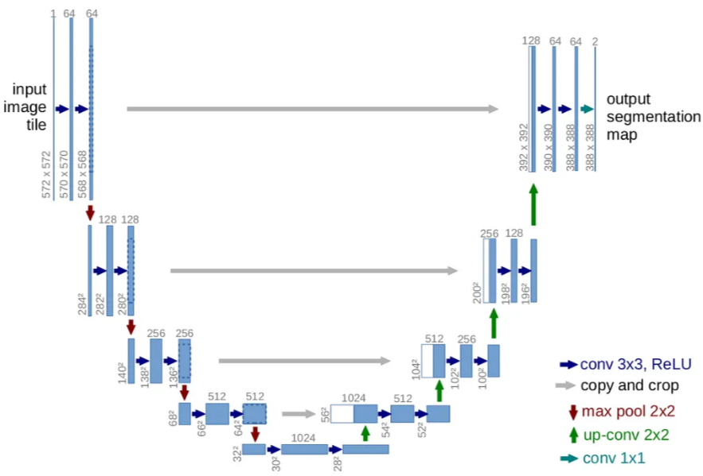
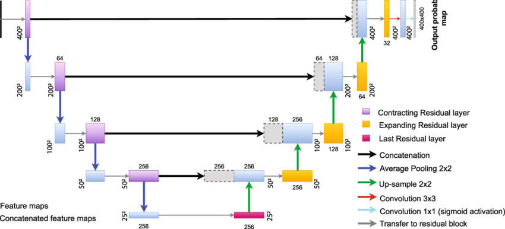
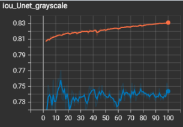
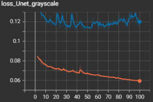

# Blood_cell_segmentation_with_Unet

## Overview
Cell segmentation is an important part of the detection and classification of tumor or disease cells in the context of pathological tissue examination. The segmentation of cancerous tissue is of great help in the development of cancer diagnosis and treatment. We believe that it is essential to explain fine needle aspiration cytology and exclusion cytology, which are used in various tests, in order to diagnose with AI and convince users. In addition to the diagnostic model, we need to understand how cancer cells are distributed and how many there are. We tried to perform cell segmentation, which is the basis for this, with Unet and ResUnet architecture.

## Dataset source
A total of 2656 images are available. 1328 Original blood cell images with 1328 corresponding ground truths. Out of that, Jeet B Lahiri separated the training and testing sets with 1169 images and 159 images respectively.
Data gernerate by Deponker, Sarker Depto, Shazidur Rahman, Md. Mekayel Hosen, Mst Shapna Akter, Tamanna Rahman Reme, Aimon Rahman, Hasib Zunai, M. Sohel Rahman and M.R.C.Mahdy

  #### Short Description
With the advent of deep learing algorithms in medial domain, there is a need for quality and large datasets. In this work, we introduced the largest microscopic blood cell segmentation dataset and benchmark different state-of-the-art algorithms on it. Our findings and contributions are particularly helpful for researchers working in deep learning with applications in medial domain.

Distributed under the MIT License.

## Unet architecture

## ResUnet architecture

## Training History
Epoch : 100 , Batch : 4, Optimizer : Adam, lr = 1e-4, Augmentation : random_flip

|
---|---|

## Result

## References
Olaf Ronneberger, Philipp Fischer, Thomas Brox. U-Net: Convolutional Networks for Biomedical Image Segmentation. arXiv, 2015. https://arxiv.org/abs/1505.04597v1

Estibaliz Gómez de Mariscal, Martin Maška, Anna Kotrbová, Vendula Pospichalova, Pavel Matula & Arrate Muñoz-Barrutia. Deep-Learning-Based Segmentation of Small Extracellular Vesicles in Transmission Electron Microscopy Images. Scientific Reports, 2019. https://www.researchgate.net/publication/335802605_Deep-Learning-Based_Segmentation_of_Small_Extracellular_Vesicles_in_Transmission_Electron_Microscopy_Images

JEET B. LAHIRI. "Blood Cell Segmentation Dataset." Kaggle. July 10, 2023. https://www.kaggle.com/datasets/jeetblahiri/bccd-dataset-with-mask

## License
Distributed under the MIT License.

