# Blood_cell_segmentation_with_Unet

## Overview
Cell segmentation plays an important role in the detection and classification of tumor or disease cells in the context of pathological tissue examination. The segmentation of cancerous tissue help in the development of cancer diagnosis and treatment. 

To create a diagnostic model, we need to understand how cancer cells are distributed and how many there are. For this purpose, we tried cell segmentation with uninet and resunet architecture. Then we used OpenCV Water shade function to understand the distribution and number.

In order to diagnose with AI and convince users, it is essential to explain fine needle aspiration cytology, cell exclusion test, etc. used in various tests.

## Dataset source
A total of 2656 images are available. 1328 Original blood cell images with 1328 corresponding ground truths. Out of that, Jeet B Lahiri separated the training and testing sets with 1169 images and 159 images respectively.
Data gernerate by Deponker, Sarker Depto, Shazidur Rahman, Md. Mekayel Hosen, Mst Shapna Akter, Tamanna Rahman Reme, Aimon Rahman, Hasib Zunai, M. Sohel Rahman and M.R.C.Mahdy

#### Short Description
With the advent of deep learing algorithms in medial domain, there is a need for quality and large datasets. In this work, we introduced the largest microscopic blood cell segmentation dataset and benchmark different state-of-the-art algorithms on it. Our findings and contributions are particularly helpful for researchers working in deep learning with applications in medial domain.

Distributed under the MIT License.

## Result

### Unet_grayscale
We can see that Unet_grayscale is overfitting from the traning history. The same is true for RGB. Below is the data for Unet_grayscale. 

##### Training History
Epoch : 100 , Batch : 4, Optimizer : Adam, lr = 1e-4, Augmentation : random_flip

|
---|---|

##### Test img
|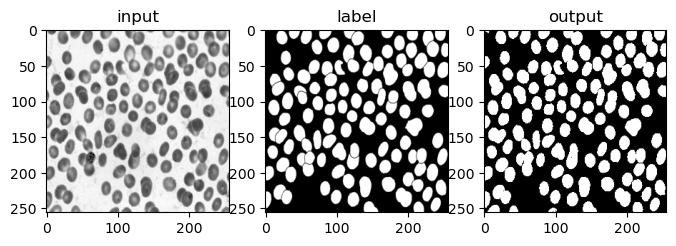
---|---|

|
---|---|

### ResUnet_grayscale
To prevent overfitting, we tried a more complex model, ResUnet. Looking at the loss rate, we concluded that ResUnet prevented overfitting. However, we noticed an increase in the loss value at certain epochs. We decided that the learning rate was too high to reach a local minimum.

And we can see the performance decrease when we look at test_img. But overfitting has been avoided. Experiment by adding a way to stably reduce the loss value.

##### Training History
Epoch : 100 , Batch : 4, Optimizer : Adam, lr = 1e-4, Augmentation : random_flip

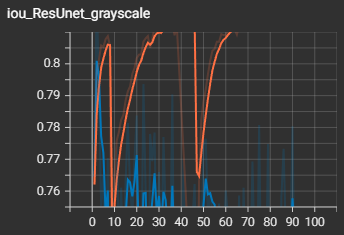|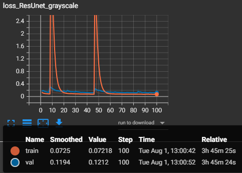
---|---|

##### Test img
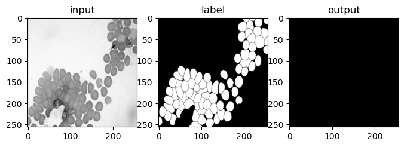|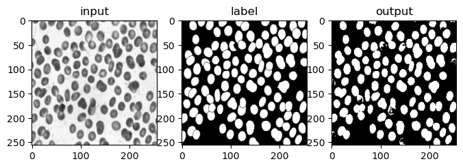
---|---|

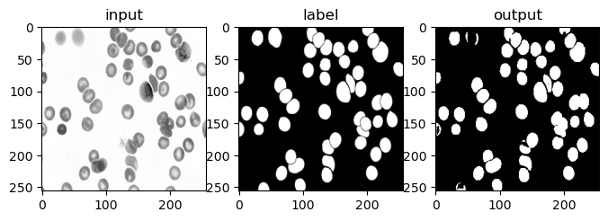|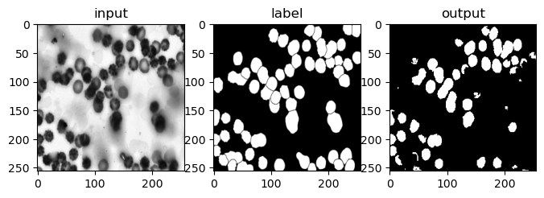
---|---|

### ResUnet_grayscale + Early stoping + Learning rate scheduler 

##### Training History
Epoch : 100 , Batch : 4, Optimizer : Adam, lr = 1e-4, Augmentation : random_flip, patience = 10

scheduler = StepLR(optim, step_size=1, gamma=0.95)

Early stop : 42epochs

|
---|---|

##### Test img
|
---|---|

|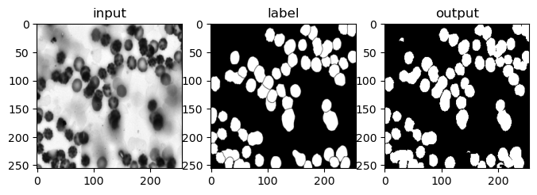
---|---|

### VGG11Unet + Early stoping + Learning rate scheduler 

##### Training History
Epoch : 100 , Batch : 4, Optimizer : Adam, lr = 1e-4, Augmentation : random_flip, patience = 10

scheduler = ReduceLROnPlateau(optim, mode='min', factor=0.5, patience=5, min_lr=1e-6)

Early stop : 36epochs

|
---|---|

##### Test img
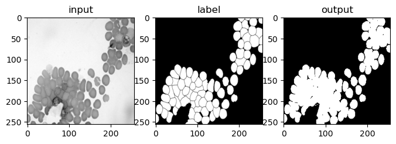|
---|---|

|
---|---|

### VGG16Unet + Early stoping + Learning rate scheduler 

##### Training History
Epoch : 100 , Batch : 4, Optimizer : Adam, lr = 1e-4, Augmentation : random_flip, patience = 10

scheduler = ReduceLROnPlateau(optim, mode='min', factor=0.5, patience=5, min_lr=1e-6)

Early stop : 39epochs

|
---|---|

##### Test img
|
---|---|

|
---|---|

### AttentionUnet + Early stoping + Learning rate scheduler 

##### Training History
Epoch : 100 , Batch : 4, Optimizer : Adam, lr = 1e-4, Augmentation : random_flip, patience = 10

scheduler = ReduceLROnPlateau(optim, mode='min', factor=0.5, patience=5, min_lr=1e-6)

Early stop : 39epochs

|
---|---|

##### Test img
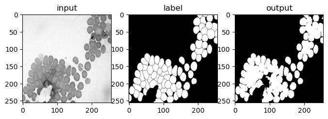|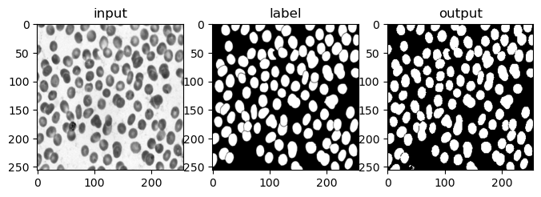
---|---|

|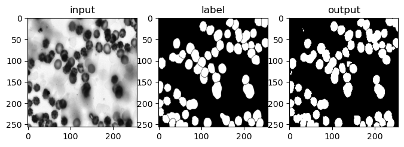
---|---|

## References
[1] JEET B. LAHIRI. "Blood Cell Segmentation Dataset." Kaggle. July 10, 2023. https://www.kaggle.com/datasets/jeetblahiri/bccd-dataset-with-mask

[2] Olaf Ronneberger, Philipp Fischer, Thomas Brox. U-Net: Convolutional Networks for Biomedical Image Segmentation. arXiv, 2015. https://arxiv.org/abs/1505.04597v1

[3] Estibaliz Gómez de Mariscal, Martin Maška, Anna Kotrbová, Vendula Pospichalova, Pavel Matula & Arrate Muñoz-Barrutia. Deep-Learning-Based Segmentation of Small Extracellular Vesicles in Transmission Electron Microscopy Images. Scientific Reports, 2019. https://www.researchgate.net/publication/335802605_Deep-Learning-Based_Segmentation_of_Small_Extracellular_Vesicles_in_Transmission_Electron_Microscopy_Images

[4] Ozan Oktay, Jo Schlemper, Loic Le Folgoc, Matthew Lee, Mattias Heinrich, Kazunari Misawa, Kensaku Mori, Steven McDonagh, Nils Y Hammerla, Bernhard Kainz, Ben Glocker, Daniel Rueckert. Attention U-Net: Learning Where to Look for the Pancreas. arXiv, 2018. https://arxiv.org/abs/1804.03999

[5] Vladimir Iglovikov, Alexey Shvets. TernausNet: U-Net with VGG11 Encoder Pre-Trained on ImageNet for Image Segmentation. arXiv, 2018.https://arxiv.org/abs/1801.05746

## License
Distributed under the MIT License.

