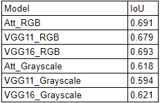

# Cell_segmentation_with_Unet

## Overview
For some types of cancer, a cytology test is essential, such as a fine needle aspiration cytology or an exclusion cytology test. Cancer is diagnosed by observing cells. Adding artificial intelligence to this process can make diagnosis easier and faster. In addition, cell segmentation is important for detection and classification in pathology. Segmentation of cancerous tissue helps in the development of cancer diagnosis and treatment.

To increase the reliability of our diagnostic model, we identified the distribution and number of cancer cells. For this purpose, we tried cell segmentation with different architectures based on Unet. After creating a mask, we used OpenCV's Contour function to determine the number and distribution of cancer cells.

Our purpose is to segment thyroid cancer data. However, our data does not have annotated images. Therefore, we utilize similar data to develop a mask generation model for our data. Also, the thyroid cancer data is limited data belonging to our project and is not available to the public. We replace it with images from the paper "Medullary Thyroid Cancer" [6], which is most similar to our data.

## Dataset source
### 1) JEET B. LAHIRI. "Blood Cell Segmentation Dataset." Kaggle. 2023.
A total of 2656 images are available. 1328 Original blood cell images with 1328 corresponding ground truths. Out of that, Jeet B Lahiri separated the training and testing sets with 1169 images and 159 images respectively.
Data gernerate by Deponker, Sarker Depto, Shazidur Rahman, Md. Mekayel Hosen, Mst Shapna Akter, Tamanna Rahman Reme, Aimon Rahman, Hasib Zunai, M. Sohel Rahman and M.R.C.Mahdy

Distributed under the MIT License.

### 2) Larxel. "Cancer Instance Segmentation and Classification 1,2,3" Kaggle. 2022.
This dataset, also known as PanNuke, contains semi automatically generated nuclei instance segmentation and classification images with exhaustive nuclei labels across 19 different tissue types. The dataset consists of 481 visual fields, of which 312 are randomly sampled from more than 20K whole slide images at different magnifications, from multiple data sources.
In total the dataset contains 205,343 labeled nuclei, each with an instance segmentation mask. Models trained on PanNuke can aid in whole slide image tissue type segmentation, and generalize to new tissues.

Distributed under the CC BY NC SA 4.0

## Result
Unet, Res_Unet, Attention_Unet, VGG11 & 16 Unet structures were used.
Unet and Res_Unet were overfitting.
We compared three models, Attention_Unet, VGG11 & 16 Unet.
Based on IoU matrix The best performance was VGG16_RGB.

Based on the effectiveness in removing impurities, lines and fluids, and good cell separation, Attention_Unet_Grayscael performed the best.

We further compared it with the Meta SAM model. The performance was marginally better. We compared run time and memory usage.
 
SAM uses Vit structure, which requires a large capitalization compared to based_Unet.

## References
[1] JEET B. LAHIRI. "Blood Cell Segmentation Dataset." Kaggle. 2023. https://www.kaggle.com/datasets/jeetblahiri/bccd-dataset-with-mask

[2] Olaf Ronneberger, Philipp Fischer, Thomas Brox. U-Net: Convolutional Networks for Biomedical Image Segmentation. arXiv, 2015. https://arxiv.org/abs/1505.04597v1

[3] Estibaliz Gómez de Mariscal, Martin Maška, Anna Kotrbová, Vendula Pospichalova, Pavel Matula & Arrate Muñoz-Barrutia. Deep-Learning-Based Segmentation of Small Extracellular Vesicles in Transmission Electron Microscopy Images. Scientific Reports, 2019. https://www.researchgate.net/publication/335802605_Deep-Learning-Based_Segmentation_of_Small_Extracellular_Vesicles_in_Transmission_Electron_Microscopy_Images

[4] Ozan Oktay, Jo Schlemper, Loic Le Folgoc, Matthew Lee, Mattias Heinrich, Kazunari Misawa, Kensaku Mori, Steven McDonagh, Nils Y Hammerla, Bernhard Kainz, Ben Glocker, Daniel Rueckert. Attention U-Net: Learning Where to Look for the Pancreas. arXiv, 2018. https://arxiv.org/abs/1804.03999

[5] Vladimir Iglovikov, Alexey Shvets. TernausNet: U-Net with VGG11 Encoder Pre-Trained on ImageNet for Image Segmentation. arXiv, 2018. https://arxiv.org/abs/1801.05746

[6] Michiya Nishino, Marc Philippe Pusztaszeri, Martha B. Pitman. Medullary Thyroid Carcinoma, In book: The Bethesda System for Reporting Thyroid Cytopathology (pp.157-175). ResearchGate, 2018. 
https://www.researchgate.net/publication/319449480_Medullary_Thyroid_Carcinoma

[7] Larxel. "Cancer Instance Segmentation and Classification 1,2,3" Kaggle. 2022. https://www.kaggle.com/datasets/andrewmvd/cancer-inst-segmentation-and-classification

[8] Gamper, Jevgenij and Koohbanani, Navid Alemi and Graham, Simon and Jahanifar, Mostafa and Benet, Ksenija and Khurram, Syed Ali and Azam, Ayesha and Hewitt, Katherine and Rajpoot, Nasir. PanNuke Dataset Extension, Insights and Baselines. arXiv, 2020.
https://arxiv.org/abs/2003.10778

## License
Distributed under the MIT License.
